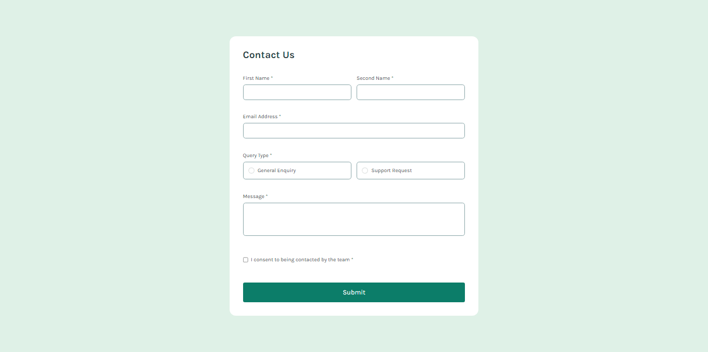

# Frontend Mentor - Contact form solution

This is a solution to the [Contact form challenge on Frontend Mentor](https://www.frontendmentor.io/challenges/contact-form--G-hYlqKJj). 

## Table of contents

- [Overview](#overview)
  - [The challenge](#the-challenge)
  - [Screenshot](#screenshot)
  - [Links](#links)
- [My process](#my-process)
  - [Built with](#built-with)
  - [What I learned](#what-i-learned)
  - [Continued development](#continued-development)
  - [Useful resources](#useful-resources)
- [Author](#author)
- [Acknowledgments](#acknowledgments)


## Overview

### The challenge

Users should be able to:

- Complete the form and see a success toast message upon successful submission
- Receive form validation messages if:
  - A required field has been missed
  - The email address is not formatted correctly
- Complete the form only using their keyboard
- Have inputs, error messages, and the success message announced on their screen reader
- View the optimal layout for the interface depending on their device's screen size
- See hover and focus states for all interactive elements on the page

### Screenshot



### Links

- Solution URL: [Add solution URL here](https://github.com/manuelcardoso5005/contact-form-main)
- Live Site URL: [Add live site URL here](https://your-live-site-url.com)

## My process

### Built with

- Semantic HTML5 markup
- CSS custom properties
- Flexbox
- Mobile-first workflow
- Vanilla JavaScript
- [Frontend Mentor](https://www.frontendmentor.io/) - Challenge platform

### What I learned

During this project, I learned how to handle form validation and dynamic class management using JavaScript. Specifically, I learned:

- How to validate user input fields, including names and emails.
- How to dynamically add and remove classes to reflect form state (e.g., greenBg for selection highlights).
- Techniques for providing feedback to users with error messages and success messages.
- How to ensure accessibility by managing focus and aria attributes.

Here is an example of the validation function I implemented:

```js
function validateEmail(email, errorElement, inputElement) {
    const regex = /^[^\s@]+@[^\s@]+\.[^\s@]+$/;
    if (!email) {
        errorElement.textContent = 'This field is required';
        errorElement.style.opacity = '1';
        inputElement.classList.remove('borderNormal');
        inputElement.classList.add('borderError');
        return false;
    } else if (!regex.test(email)) {
        errorElement.textContent = 'Please enter a valid email address';
        errorElement.style.opacity = '1';
        inputElement.classList.remove('borderNormal');
        inputElement.classList.add('borderError');
        return false;
    } else {
        errorElement.style.opacity = '0';
        inputElement.classList.remove('borderError');
        inputElement.classList.add('borderNormal');
        return true;
    }
}
```

### Continued development

- Explore using frameworks like React or Vue.js to handle form states and validations more efficiently.
- Improve my understanding of form accessibility and make forms more robust for different user needs.
- Implement more complex form scenarios, such as multi-step forms or dynamic fields.

### Useful resources

[JavaScript Info](https://javascript.info/) - An excellent resource for learning advanced JavaScript techniques.
[MDN Web Docs](https://developer.mozilla.org/en-US/) - Comprehensive resource for web development standards and best practices.
[Frontend Mentor Community](https://www.frontendmentor.io/community) - Great place for discussing challenges and learning from other developers.

## Author

- Frontend Mentor - [@manuelcardoso5005](https://www.frontendmentor.io/profile/manuelcardoso5005)
- Linkedin - [@manuelcardoso5005](https://www.linkedin.com/in/manuelcardoso5005/)

## Acknowledgments

I would like to thank the Frontend Mentor community for their support and feedback.